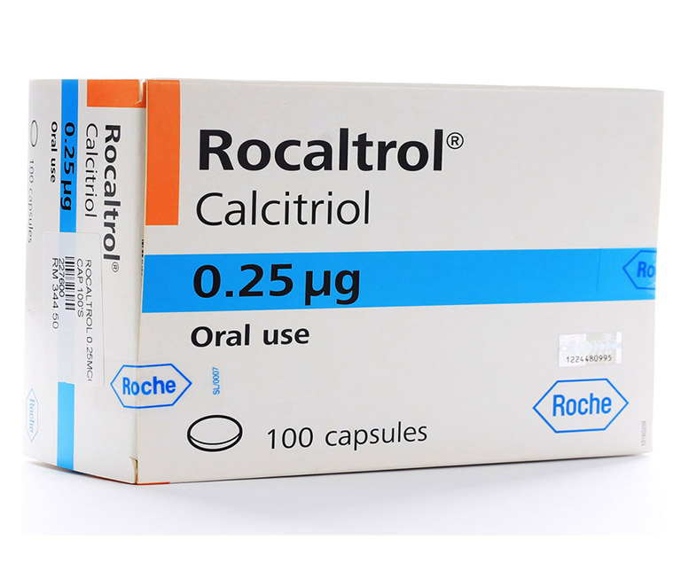

# Thuốc Rocaltrol có công dụng gì?

Công dụng

Calcitriol là một hình thức hoạt động nhân tạo của vitamin D . Hầu hết mọi người nhận đủ vitamin D khi tiếp xúc với ánh nắng mặt trời và từ các sản phẩm thực phẩm tăng cường \(ví dụ, các sản phẩm từ sữa, vitamin \). Vitamin D giúp kiểm soát hormone tuyến cận giáp và mức độ của một số khoáng chất \(ví dụ, canxi , phốt pho\) cần thiết để xây dựng và giữ cho xương chắc khỏe.

Trước khi vitamin D có thể được sử dụng thường xuyên bởi cơ thể, nó cần được thay đổi thành dạng hoạt động của gan và thận . Calcitriol được sử dụng ở những bệnh nhân với bệnh thận người không thể tạo ra đủ các hình thức hoạt động của vitamin D. Đây thuốc cũng được dùng để ngăn ngừa và điều trị một số loại canxi / phospho / vấn đề cận giáp có thể xảy ra với dài hạn thẩm tách thận hoặc suy tuyến cận giáp . Calcitriol thường được sử dụng cùng với các khuyến nghị chế độ ăn uống cụ thể và đôi khi các loại thuốc khác .

Cách sử dụng [thuốc Rocaltrol](https://thuocdantoc.vn/thuoc/rocaltrol)

Dùng thuốc này bằng miệng có hoặc không có thức ăn, thường là một lần mỗi ngày hoặc theo chỉ dẫn của bác sĩ. Nếu bạn đang sử dụng dạng lỏng, hãy đo liều của bạn bằng muỗng hoặc dụng cụ đo đặc biệt. Không sử dụng muỗng gia đình bình thường vì bạn có thể không dùng đúng liều.

Liều dùng dựa trên tình trạng y tế của bạn và đáp ứng với điều trị. Bác sĩ có thể bắt đầu bạn với liều thấp và điều chỉnh liều từ từ để tìm ra liều tốt nhất cho bạn. Làm theo chỉ dẫn của bác sĩ một cách cẩn thận. Sử dụng thuốc này thường xuyên để có được lợi ích cao nhất từ ​​nó. Để giúp bạn nhớ, hãy dùng nó cùng một lúc mỗi ngày.

Điều rất quan trọng là phải tuân theo chế độ ăn uống được bác sĩ khuyên dùng để có được lợi ích cao nhất từ ​​thuốc này và ngăn ngừa các tác dụng phụ nghiêm trọng. Không dùng các chất bổ sung / vitamin khác \(ví dụ: canxi , vitamin D \) trừ khi bác sĩ yêu cầu.

Một số loại thuốc \(phụ gia cô lập acid mật như cholestyramine / colestipol , dầu khoáng , orlistat \) có thể làm giảm sự hấp thu vitamin D . Do đó, hãy tách riêng các liều thuốc này càng xa càng tốt với liều calcitriol của bạn \(cách nhau ít nhất 2 giờ, lâu hơn nếu có thể\). Có thể dễ dàng nhất để uống calcitriol khi đi ngủ nếu bạn cũng đang dùng các loại thuốc khác. Hỏi bác sĩ hoặc dược sĩ của bạn về việc tìm kiếm một lịch trình dùng thuốc tốt sẽ làm việc với tất cả các loại thuốc của bạn.

Tác dụng phụ

Calcitriol thường không có tác dụng phụ. Bác sĩ có thể kiểm tra nồng độ canxi và phốt phát trong máu và điều chỉnh liều nếu bạn có tác dụng phụ.

Hãy nhớ rằng bác sĩ của bạn đã kê toa thuốc này bởi vì họ đã đánh giá rằng lợi ích cho bạn lớn hơn nguy cơ tác dụng phụ. Nhiều người sử dụng thuốc này không có tác dụng phụ nghiêm trọng.

Hãy cho bác sĩ của bạn ngay lập tức nếu có bất kỳ tác dụng phụ không mong muốn nhưng nghiêm trọng nào xảy ra: chán ăn, đau lưng / xương / [dấu hiệu thoái hóa khớp](https://www.24h.com.vn/tin-tuc-suc-khoe/thoai-hoa-khop-nguyen-nhan-dau-hieu-va-cach-dieu-tri-de-benh-mot-di-khong-tro-lai-c683a992649.html) / đau cơ , táo bón , khô miệng , đau mắt / đỏ / nhạy cảm với ánh sáng, nhức đầu , nhanh / chậm / không đều nhịp tim, buồn nôn / nôn / tiêu chảy , buồn ngủ, đau dạ dày / bụng , khát nước tăng, có dấu hiệu của các vấn đề về thận \(như thay đổi lượng nước tiểu\), yếu .

Một phản ứng dị ứng rất nghiêm trọng với thuốc này là không thể, nhưng tìm kiếm sự chăm sóc y tế ngay lập tức nếu nó xảy ra. Các triệu chứng của phản ứng dị ứng nghiêm trọng có thể bao gồm: phát ban , ngứa / sưng \(đặc biệt là mặt / lưỡi / cổ họng\), chóng mặt nghiêm trọng , khó thở .

Đây không phải là một danh sách đầy đủ các tác dụng phụ có thể. Nếu bạn nhận thấy các tác dụng khác không được liệt kê ở trên, liên hệ với bác sĩ hoặc dược sĩ của bạn .

Phòng ngừa

Trước khi dùng calcitriol, hãy nói với bác sĩ hoặc dược sĩ của bạn nếu bạn bị dị ứng với nó; hoặc các sản phẩm vitamin D khác; hoặc nếu bạn có bất kỳ dị ứng khác . Sản phẩm này có thể chứa các thành phần không hoạt động, có thể gây ra phản ứng dị ứng hoặc các vấn đề khác. Nói chuyện với dược sĩ của bạn để biết thêm chi tiết.

Đây thuốc không nên được sử dụng nếu bạn có điều kiện y tế nhất định. Trước khi sử dụng thuốc này, hãy tham khảo ý kiến ​​bác sĩ hoặc dược sĩ nếu bạn có: nồng độ canxi cao.

Trước khi sử dụng thuốc này, hãy cho bác sĩ hoặc dược sĩ biết tiền sử bệnh của bạn, đặc biệt là: bệnh tim \(ví dụ: nhịp tim không đều, bệnh động mạch vành \), bệnh thận , sỏi thận .

Thông báo cho bác sĩ của bạn trước nếu bạn sẽ được phẫu thuật hoặc sẽ bị giới hạn trong một chiếc ghế / giường \(bất động\) trong một thời gian dài. Bất động trong thời gian dài làm tăng nguy cơ tác dụng phụ của bạn.

Hãy chắc chắn uống nhiều nước trừ khi có chỉ định của bác sĩ.

Khi mang thai , thuốc này chỉ nên được sử dụng khi cần thiết rõ ràng. Thảo luận về những rủi ro và lợi ích với bác sĩ của bạn.

Đó là chưa biết nếu thuốc này đi vào vú sữa. Tham khảo ý kiến ​​bác sĩ trước khi cho con bú .

Tương tác

Xem thêm Cách sử dụng phần.

Tương tác thuốc có thể thay đổi cách thuốc của bạn hoạt động hoặc tăng nguy cơ tác dụng phụ nghiêm trọng. Tài liệu này không chứa tất cả các tương tác thuốc có thể . Giữ một danh sách tất cả các sản phẩm bạn sử dụng \(bao gồm cả thuốc kê toa / thuốc không kê toa và các sản phẩm thảo dược\) và chia sẻ với bác sĩ và dược sĩ của bạn . Không bắt đầu, dừng hoặc thay đổi liều lượng của bất kỳ loại thuốc nào mà không có sự chấp thuận của bác sĩ.

Một số sản phẩm có thể tương tác với thuốc này bao gồm: glycoside tim \(ví dụ: digoxin , digitalis\), thuốc chứa magiê \(ví dụ: thuốc kháng axit, sữa magiê \), chất kết dính phốt phát, vitamin / chất bổ sung dinh dưỡng \(đặc biệt là canxi và vitamin D \), thuốc có thể tăng tốc độ loại bỏ calcitriol khỏi cơ thể của bạn \(ví dụ: ketoconazole , phenobarbital , phenytoin\).

Kiểm tra nhãn trên tất cả các toa thuốc của bạn và không cần toa / sản phẩm thảo dược \(ví dụ, thuốc kháng acid, thuốc nhuận tràng , vitamin \) vì chúng có thể chứa canxi , magiê, phốt phát, và vitamin D . Hỏi dược sĩ của bạn về việc sử dụng các sản phẩm đó một cách an toàn.

Calcitriol rất giống với các dạng vitamin D. Không sử dụng các loại thuốc có chứa các dạng vitamin D khác trong khi sử dụng calcitriol.

Thuốc này có thể can thiệp vào một số xét nghiệm trong phòng thí nghiệm \(ví dụ: xét nghiệm cholesterol \), có thể gây ra kết quả xét nghiệm sai. Hãy chắc chắn rằng nhân viên phòng thí nghiệm và tất cả các bác sĩ của bạn biết bạn sử dụng thuốc này.

Quá liều

Nếu ai đó đã sử dụng quá liều và có các triệu chứng nghiêm trọng như bất tỉnh hoặc khó thở , hãy gọi 911. Nếu không, hãy gọi ngay cho trung tâm kiểm soát chất độc. Cư dân Hoa Kỳ có thể gọi cho trung tâm kiểm soát chất độc tại địa phương của họ theo số 1- 800-222-1222. Cư dân Canada có thể gọi một trung tâm kiểm soát chất độc tỉnh. Các triệu chứng của quá liều có thể bao gồm: yếu , đau đầu , chán ăn, vị kim loại , buồn nôn , nôn , co thắt dạ dày , chóng mặt .

Ghi chú

Không dùng chung thuốc này với người khác.

Các xét nghiệm trong phòng thí nghiệm và / hoặc y tế \(ví dụ, nồng độ canxi , magiê , phốt pho, tuyến cận giáp\) nên được thực hiện định kỳ để theo dõi tiến trình của bạn hoặc kiểm tra tác dụng phụ. Tham khảo ý kiến ​​bác sĩ của bạn để biết thêm chi tiết.

Thực phẩm giàu vitamin D bao gồm: các sản phẩm từ sữa tăng cường, trứng, cá mòi, dầu gan cá , gan gà và cá nước ngọt. Vitamin D cũng thu được từ việc tiếp xúc với ánh nắng mặt trời định kỳ.

Điều quan trọng là duy trì chế độ ăn uống cân bằng trong khi dùng thuốc này. Bổ sung canxi có thể được khuyến cáo ngoài thuốc này. Khuyến cáo thông thường cho canxi là 600 đến 1200 miligam mỗi ngày. Thảo luận với bác sĩ của bạn. Không dùng chất bổ sung trừ khi có chỉ định của bác sĩ.

Mất liều

Nếu bạn bỏ lỡ một liều, hãy uống ngay khi nhớ ra. Nếu gần đến thời điểm dùng liều tiếp theo, hãy bỏ qua liều dùng và tiếp tục lịch trình dùng thuốc thông thường của bạn. Đừng gấp đôi liều để bắt kịp.

Lưu trữ

Bảo quản ở nhiệt độ phòng trong khoảng 59-86 độ F \(15-30 độ C\) tránh ánh sáng và độ ẩm. Không lưu trữ trong phòng tắm. Giữ tất cả các loại thuốc tránh xa trẻ em và vật nuôi.

Không xả thuốc xuống nhà vệ sinh hoặc đổ chúng vào cống trừ khi được hướng dẫn làm như vậy. Vứt bỏ đúng cách sản phẩm này khi hết hạn hoặc không còn cần thiết. Tham khảo ý kiến dược sĩ hoặc công ty xử lý chất thải tại địa phương để biết thêm chi tiết về cách loại bỏ sản phẩm của bạn một cách an toàn. Thông tin sửa đổi lần cuối vào tháng 7 năm 2016. Bản quyền \(c\) 2016 First Databank, Inc.

Nguồn: https://www.webmd.com/drugs/2/drug-7447/rocaltrol-oral/details

